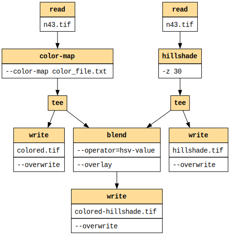

# gdalgviz

A Python library to visualise [GDAL pipelines](https://gdal.org/en/latest/programs/gdal_pipeline.html).

## Installation

Requires [graphviz](https://graphviz.org/) to be installed on the system and available on the
system PATH. See the [installation instructions](https://graphviz.org/download/) for your operating system.

GDAL itself is not required to be installed to use this library, as it only visualises the pipeline, it does not execute it.

On Linux (example installation):

```bash
apt update
apt install graphviz --yes
dot -V
apt install pipx --yes
pipx ensurepath
pipx install gdalgviz
# for Docker images
# export PATH="$HOME/.local/bin:$PATH"
gdalgviz --version
gdalgviz --pipeline "gdal vector pipeline ! read in.gpkg ! reproject --dst-crs=EPSG:32632 ! select --fields fid,geom" pipeline.svg
```

On Windows (assuming pip and Python are on the system PATH):

```powershell
$GVIZ_PATH = "C:\Program Files\Graphviz\bin"
$env:PATH = "$GVIZ_PATH;$env:PATH"
dot -V
pip install gdalgviz
gdalgviz --version
gdalgviz --pipeline "gdal vector pipeline ! read in.gpkg ! reproject --dst-crs=EPSG:32632 ! select --fields fid,geom" pipeline.svg
```

## Usage

```
usage: gdalgviz [-h] [--pipeline PIPELINE] [--vertical] [--font FONT] [--header-color HEADER_COLOR] [--version] [--docs-root DOCS_ROOT] [input_path] output_path

Visualize GDAL datasets from the command line

positional arguments:
  input_path            Path to a GDALG pipeline in JSON or text format
  output_path           Path to save the generated diagram (e.g., output.svg)

options:
  -h, --help            show this help message and exit
  --pipeline PIPELINE   Provide a raw GDALG pipeline string instead of a file
  --vertical            Render the diagram top-to-bottom instead of left-to-right
  --font FONT           Font name for diagram nodes (default: Helvetica)
  --header-color HEADER_COLOR
                        Background color for node headers as a hex color code (default: #cfe2ff)
  --version             show program's version number and exit
  --docs-root DOCS_ROOT
                        Root URL for GDAL documentation links(default: https://gdal.org/en/latest/programs)
```

## Examples

Passing a pipeline as a JSON file ([tee.json](./examples/tee.json)):

```bash
gdalgviz ./examples/tee.json ./examples/tee.svg
```


Passing a pipeline as a string:

```bash
gdalgviz --pipeline "gdal vector pipeline ! read in.gpkg ! reproject --dst-crs=EPSG:32632 ! select --fields fid,geom" pipeline.svg
```


Using the vertical layout option, with a custom font and header colour:

```bash
gdalgviz ./examples/tee.json ./examples/tee-custom.svg --vertical --font "Courier" --header-color "#ffdd99"
```



## Features

- Handles both JSON and text input. See [JSON Schema](./examples/gdalg.schema.json) for the required JSON structure.
- SVG output supports clickable nodes that link to the corresponding GDAL documentation for each command. 
  See the [example](https://raw.githubusercontent.com/geographika/gdalgviz/refs/heads/main/examples/tee.svg).
- Supports [nested pipelines](https://gdal.org/en/latest/programs/gdal_pipeline.html#nested-pipeline). These
  allow sub-pipelines to be run in parallel and merged later.
- Supports [tee](https://gdal.org/en/latest/programs/gdal_pipeline.html#output-nested-pipeline) - 
  the operation is named "tee" because it splits the stream, like the letter "T": one input, multiple outputs,
  and allows saving of intermediate results

This library does not execute the GDAL pipeline, it only visualizes it. The actual execution of the pipeline is done by GDAL itself.

```python
from osgeo import gdal

gdal.UseExceptions()
with gdal.alg.pipeline(pipeline="read byte.tif ! reproject --dst-crs EPSG:4326 --resampling cubic") as alg:
    ds = alg.Output()
```

## Development

```powershell
pip install -e .[dev]
black .
ruff check . --fix
# mypy .
pytest tests
gdalgviz ./examples/tee.json ./examples/tee.svg
gdalgviz --pipeline "gdal vector pipeline ! read in.gpkg ! reproject --dst-crs=EPSG:32632 ! select --fields fid,geom" ./examples/pipeline.svg

```

## RoadMap

- Add JSON schema validation
- Add colour coding of the graph depending on if the command is raster, vector etc.
- Add types to the codebase
- Add pipeline command formatting