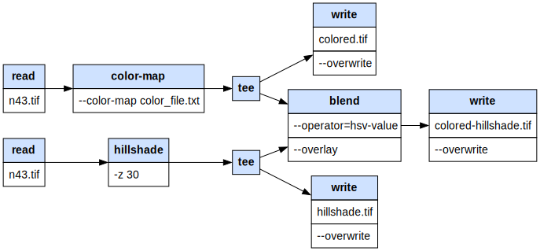

# gdalgviz

A Python library to visualise [GDAL pipelines](https://gdal.org/en/latest/programs/gdal_pipeline.html).

## Installation

Requires [graphviz](https://graphviz.org/download/) to be installed on the system, and 
has a dependency on the [graphviz](https://pypi.org/project/graphviz/) Python package.

On Windows:

```powershell
$GVIZ_PATH = "C:\Program Files\Graphviz\bin"
$env:PATH = "$GVIZ_PATH;$env:PATH"
pip install gdalgviz
gdalgviz --version
```

## Usage

Passing a pipeline as a JSON file ([tee.json](./examples/tee.json)):

```bash
gdalgviz ./examples/tee.json ./examples/tee.svg
```



Passing a pipeline as a string:

```bash
gdalgviz --pipeline "gdal vector pipeline ! read in.tif ! reproject --dst-crs=EPSG:32632 ! select --fields fid,geom" ./examples/pipeline.svg
```


- Handles both JSON and text input. See [JSON Schema](./examples/gdalg.schema.json)
- Supports [nested pipelines](https://gdal.org/en/latest/programs/gdal_pipeline.html#nested-pipeline). These
  allow sub-pipelines to be run in parallel and merged later.
- Supports [tee](https://gdal.org/en/latest/programs/gdal_pipeline.html#output-nested-pipeline) - 
  the operation is named "tee" because it splits the stream, like the letter "T": one input, multiple outputs,
  and allows saving of intermediate results

This library does not execute the GDAL pipeline, it only visualizes it. The actual execution of the pipeline is done by GDAL itself.

```python
from osgeo import gdal

gdal.UseExceptions()
with gdal.alg.pipeline(pipeline="read byte.tif ! reproject --dst-crs EPSG:4326 --resampling cubic") as alg:
    ds = alg.Output()
```

## Development

```powershell
pip install -e .[dev]
black .
ruff check . --fix
# mypy .
pytest tests
gdalgviz ./examples/tee.json ./examples/tee.svg
gdalgviz --pipeline "gdal vector pipeline ! read in.tif ! reproject --dst-crs=EPSG:32632 ! select --fields fid,geom" ./examples/pipeline.svg

```

## RoadMap

- Add JSON schema validation
- Add colour coding of the graph depending on if the command is raster, vector etc.
- Add types to the codebase